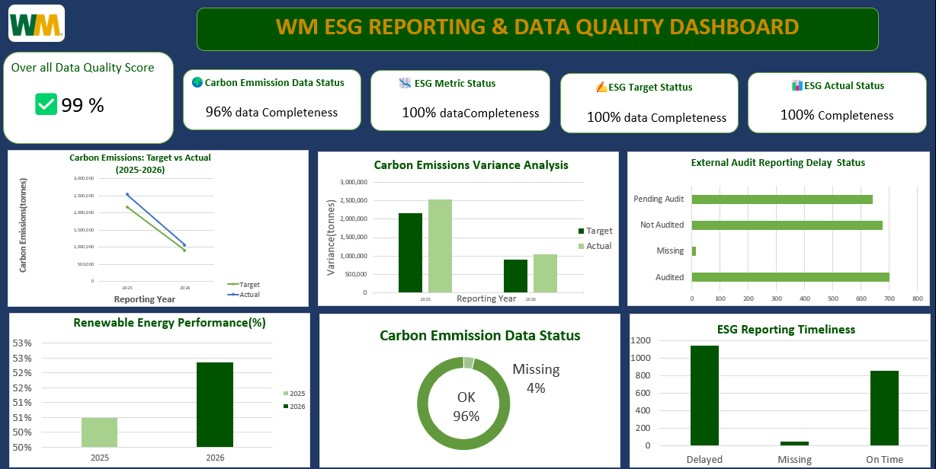

This Project aimed to evaluate the quality and reliability of ESG reporting data at WM(Waste management)and identify areas for improvement. 
I analysed 2035 ESG data set to assess the data quality across five critical sustainability metrics: Carbon Emissions, ESG Metric, ESG Target and ESG actual and the reporting performance for the period of 2025-2026
## Dashboard Preview

# ESG Data Quality Analysis at WM

## Executive Summary
This project evaluates the quality and reliability of ESG data reported by WM for 2025. The analysis identifies gaps in sustainability reporting and provides insights to improve data accuracy, completeness and decision-making.

## Business Problem
Reliable ESG data is essential for organisations to monitor sustainability performance, meet regulatory requirements and support informed business decisions. Poor-quality data can result in inaccurate reporting and ineffective sustainability strategies.

## Project Objectives
- Assess ESG data quality across key sustainability metrics.
- Identify missing, inaccurate and inconsistent records.
- Measure reporting performance.
- Recommend actions to improve data quality.

## Dataset
The dataset contains ESG performance information for 2025, including:
- Carbon Emissions
- Energy Consumption
- Water Usage
- Waste Management
- Recycling Rate

## Tools Used
- Pivot tables
- Microsoft Excel
- Data Cleaning
- Data Visualisation

## Dashboard Preview

## Key Insights
- The actual Carbon emissions exceeded targets in both 2025 and 2026.
- Delayed submissions accounted for 56% of all reports, making them the most significant data quality issue. While 42% of reports were submitted on time and only 2% were missing, improving reporting timeliness remains a key priority. .
- Most ESG records were externally audited, demonstrating a strong commitment to independent assurance. However, the relatively high number of Not Audited and Pending Audit records highlights the need to improve audit coverage..
- Overall ESG data quality exceeded the target threshold.

## Recommendations
- Improve validation during data collection.
- Standardise ESG reporting across departments.
- Automate data quality checks.
- Monitor KPIs through interactive dashboards.
